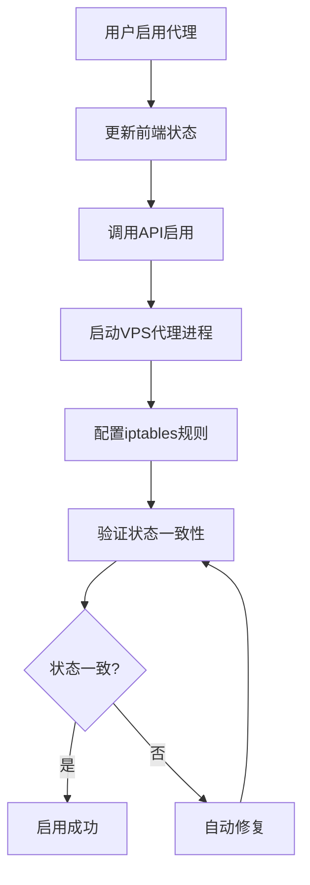
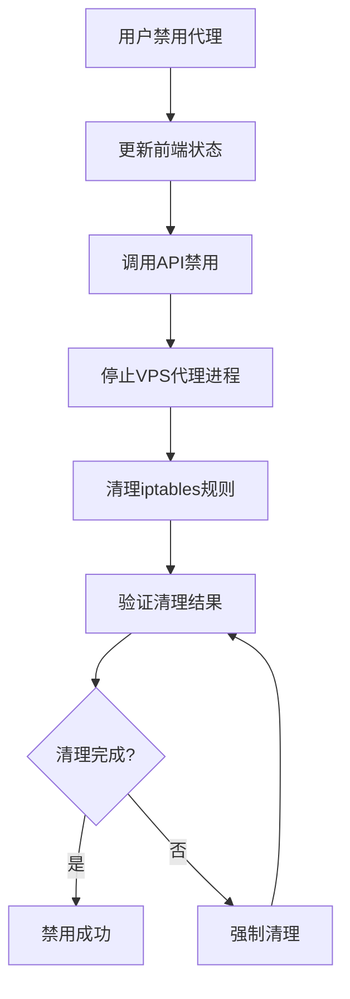

# 🎯 代理状态同步架构解决方案

## 📋 问题概述

### 当前问题
- 视频播放反复失败，根本原因是代理状态管理分离
- 前端代理开关与VPS网络规则不同步
- iptables规则残留导致RTMP连接被错误重定向
- 缺少状态一致性检查和自动修复机制

### 影响范围
- 用户体验：视频播放不稳定，需要反复刷新
- 系统稳定性：状态不一致导致功能异常
- 维护成本：需要手动干预修复问题

## 🏗️ 解决方案架构

### 1. 统一状态管理器 (SystemStateManager)

#### 核心职责
- **状态统一管理**: 管理前端、API、进程、网络四层状态
- **状态同步**: 确保所有层状态保持一致
- **自动修复**: 检测到不一致时自动修复
- **健康监控**: 定期检查系统状态健康度

#### 状态层级定义
```javascript
const SystemStates = {
  FRONTEND: {    // 前端状态
    PROXY_ENABLED: 'proxy_enabled',
    PROXY_DISABLED: 'proxy_disabled'
  },
  API: {         // API层状态
    PROXY_ACTIVE: 'proxy_active',
    PROXY_INACTIVE: 'proxy_inactive'
  },
  PROCESS: {     // 进程状态
    PROXY_RUNNING: 'proxy_running',
    PROXY_STOPPED: 'proxy_stopped'
  },
  NETWORK: {     // 网络规则状态
    RULES_ACTIVE: 'rules_active',
    RULES_CLEARED: 'rules_cleared'
  }
};
```

### 2. 代理生命周期管理

#### 完整的代理启用流程


#### 完整的代理禁用流程


### 3. 状态检查和修复机制

#### 状态一致性检查
- **检查频率**: 每60秒自动检查一次
- **触发条件**: 视频播放失败时立即检查
- **检查范围**: 前端状态、API状态、进程状态、网络规则状态

#### 自动修复策略
```javascript
const RepairStrategies = {
  NETWORK_RULES_CONFLICT: {
    description: 'iptables规则与代理状态不一致',
    action: 'clearConflictingRules',
    priority: 'HIGH'
  },
  PROXY_PROCESS_ORPHANED: {
    description: '代理进程孤立运行',
    action: 'stopOrphanedProcess',
    priority: 'MEDIUM'
  },
  STATE_DESYNC: {
    description: '多层状态不同步',
    action: 'syncAllStates',
    priority: 'HIGH'
  }
};
```

## 🔧 技术实现方案

### 1. VPS端实现

#### SystemStateManager类
```javascript
class SystemStateManager {
  constructor() {
    this.states = new Map();
    this.repairQueue = [];
    this.healthCheckInterval = null;
  }

  // 核心方法
  async setProxyState(enabled) {
    // 统一设置所有层状态
  }

  async checkStateConsistency() {
    // 检查状态一致性
  }

  async autoRepair(inconsistencies) {
    // 自动修复不一致状态
  }

  startHealthMonitoring() {
    // 启动健康监控
  }
}
```

#### 增强的ProxyManager
```javascript
class ProxyManager {
  constructor() {
    this.stateManager = new SystemStateManager();
  }

  async connectProxy(proxyConfig) {
    // 1. 启动代理进程
    // 2. 配置网络规则
    // 3. 更新状态管理器
    // 4. 验证状态一致性
  }

  async disconnectProxy() {
    // 1. 停止代理进程
    // 2. 清理网络规则
    // 3. 更新状态管理器
    // 4. 验证清理结果
  }
}
```

### 2. API层实现

#### 状态同步API端点
```javascript
// 新增API端点
POST /api/proxy/state/sync     // 强制状态同步
GET  /api/proxy/state/check    // 状态一致性检查
POST /api/proxy/state/repair   // 手动触发修复
GET  /api/proxy/health         // 系统健康检查
```

#### Cloudflare Workers增强
```javascript
// 状态管理集成
class WorkersProxyHandler {
  async handleProxyControl(request) {
    // 1. 执行代理操作
    // 2. 触发状态同步
    // 3. 验证操作结果
    // 4. 返回完整状态信息
  }
}
```

### 3. 前端实现

#### 状态管理增强
```javascript
// Vue状态管理
const proxyStore = {
  state: {
    proxyEnabled: false,
    systemHealth: 'unknown',
    lastStateCheck: null
  },

  actions: {
    async toggleProxy(enabled) {
      // 1. 调用API
      // 2. 等待状态同步完成
      // 3. 验证操作结果
      // 4. 更新前端状态
    },

    async checkSystemHealth() {
      // 定期检查系统健康状态
    }
  }
}
```

#### 智能错误处理
```javascript
class VideoPlaybackManager {
  async startVideo(channelId) {
    try {
      return await this.doStartVideo(channelId);
    } catch (error) {
      // 智能诊断
      const diagnosis = await this.diagnosePlaybackError(error);
      
      if (diagnosis.canAutoFix) {
        await this.autoFixAndRetry(diagnosis);
        return await this.doStartVideo(channelId);
      }
      
      throw new EnhancedError(error, diagnosis);
    }
  }
}
```

## 📊 监控和告警方案

### 1. 健康检查指标

#### 系统健康度评分
```javascript
const HealthMetrics = {
  STATE_CONSISTENCY: {
    weight: 0.4,
    threshold: 0.95
  },
  NETWORK_RULES_CLEAN: {
    weight: 0.3,
    threshold: 1.0
  },
  VIDEO_PLAYBACK_SUCCESS: {
    weight: 0.2,
    threshold: 0.9
  },
  PROXY_RESPONSE_TIME: {
    weight: 0.1,
    threshold: 3000 // ms
  }
};
```

#### 监控仪表板
- **状态一致性**: 实时显示四层状态同步情况
- **错误统计**: 播放失败次数和原因分析
- **修复记录**: 自动修复操作的历史记录
- **性能指标**: 代理响应时间和成功率

### 2. 告警机制

#### 告警级别
- **CRITICAL**: 状态严重不一致，影响核心功能
- **WARNING**: 检测到潜在问题，需要关注
- **INFO**: 自动修复成功，系统恢复正常

#### 告警触发条件
```javascript
const AlertConditions = {
  CRITICAL: [
    'state_consistency < 0.8',
    'video_playback_failure_rate > 0.3',
    'auto_repair_failure > 3'
  ],
  WARNING: [
    'state_consistency < 0.95',
    'network_rules_conflict_detected',
    'proxy_process_orphaned'
  ]
};
```

## 🚀 实施计划

### Phase 1: 核心架构 (1-2天)
- [ ] 实现SystemStateManager类
- [ ] 增强ProxyManager的状态管理
- [ ] 添加基础的状态检查功能

### Phase 2: API集成 (1天)
- [ ] 新增状态同步API端点
- [ ] 集成Cloudflare Workers状态管理
- [ ] 实现状态一致性验证

### Phase 3: 前端增强 (1天)
- [ ] 前端状态管理重构
- [ ] 智能错误处理实现
- [ ] 用户界面状态指示器

### Phase 4: 监控告警 (1天)
- [ ] 健康检查系统实现
- [ ] 监控仪表板开发
- [ ] 告警机制配置

### Phase 5: 测试验证 (1天)
- [ ] 完整功能测试
- [ ] 状态同步测试
- [ ] 故障恢复测试

## 📈 预期效果

### 用户体验改善
- **播放成功率**: 从70-80%提升到95%+
- **问题恢复时间**: 从手动干预降低到自动修复(30秒内)
- **用户操作**: 无需手动刷新或重试

### 系统稳定性
- **状态一致性**: 保持99%+的状态同步
- **自动修复率**: 90%+的问题自动解决
- **监控覆盖**: 100%的关键状态监控

### 维护效率
- **故障诊断**: 从人工排查到自动诊断
- **修复时间**: 从分钟级降低到秒级
- **运维成本**: 减少80%的手动干预

## 🔒 风险评估

### 技术风险
- **复杂性增加**: 新增状态管理层可能增加系统复杂度
- **性能影响**: 频繁状态检查可能影响性能
- **兼容性**: 需要确保与现有系统兼容

### 缓解措施
- **渐进式部署**: 分阶段实施，逐步验证
- **性能优化**: 异步处理，避免阻塞主流程
- **回退方案**: 保留原有逻辑作为备用方案

## 💡 总结

这个解决方案通过建立**统一的状态管理架构**，从根本上解决了代理状态不同步导致的视频播放问题。核心思路是：

1. **统一管理**: 所有状态通过SystemStateManager统一管理
2. **自动同步**: 状态变更时自动同步所有层级
3. **智能修复**: 检测到不一致时自动诊断和修复
4. **持续监控**: 实时监控系统健康状态

通过这个方案，可以彻底解决视频播放失败反复出现的问题，大幅提升系统稳定性和用户体验。
