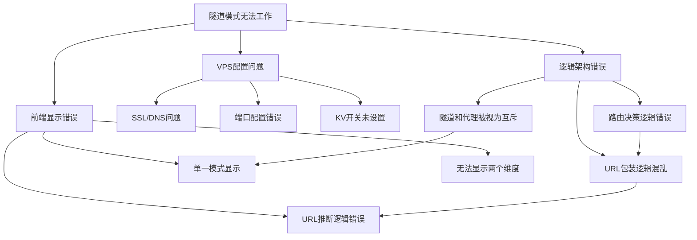

# 🔧 隧道模式完整修复计划

**创建时间**: 2025-10-23 12:36  
**问题来源**: 综合分析三个相关问题文档  
**修复目标**: 完全修复隧道模式，使其正常工作并正确显示

---

## 📋 **问题关系图**



---

## 🎯 **核心问题总结**

### **问题1: VPS部署配置问题** 🔴

**位置**: VPS服务器 + Cloudflare设置

**问题清单**:
1. ❌ **SSL/TLS证书问题** - 隧道域名无法HTTPS访问
2. ❌ **DNS CNAME记录** - 可能缺失或未生效
3. ❌ **VPS配置端口错误** - tunnel-api指向52535应该是3000
4. ❓ **KV开关未验证** - RUNTIME_TUNNEL_ENABLED状态未知

**影响**:
- 隧道端点完全无法访问
- 即使代码正确也无法工作

---

### **问题2: 核心架构逻辑错误** 🔴

**位置**: `tunnel-router.js`, `streams.js`, `proxy.js`

**核心错误**:
```
❌ 错误理解：隧道、代理、直连是互斥的三种模式
✅ 正确理解：这是两个独立的维度

维度1: Workers → VPS (tunnel/direct)  - 前端路径
维度2: VPS → RTMP源 (proxy/direct)    - 后端路径
```

**具体问题**:
1. ❌ `TunnelRouter.getOptimalEndpoints()` 将代理状态作为路由模式
2. ❌ 隧道启用后不再检查代理状态
3. ❌ 无法支持tunnel+proxy组合
4. ❌ `wrapHlsUrlForCurrentMode()` 包含混淆的proxy分支

---

### **问题3: 前端显示逻辑错误** 🔴

**位置**: `VideoPlayer.vue`

**问题清单**:
1. ❌ 单一的`connectionMode`变量，只能显示一个状态
2. ❌ UI只有一个标签，无法同时显示前端和后端路径
3. ❌ URL推断逻辑包含混淆的`/tunnel-proxy/`路径检测
4. ❌ 响应头只读取`X-Route-Via`，缺少后端状态

---

### **问题4: URL设计混乱** 🟡

**位置**: Workers路由 + URL包装函数

**问题清单**:
1. ❌ 存在混淆的`/tunnel-proxy/`路径
2. ❌ 三种URL设计，实际应该只有两种
3. ❌ 将VPS代理状态混入URL路径

---

## 🔄 **问题相互关系**

### **依赖关系**

```
问题1 (VPS配置) 
  └─> 必须先修复，否则隧道端点无法访问
      └─> 问题2 (架构逻辑)
          └─> 修复逻辑后才能正确路由
              └─> 问题3 (前端显示)
                  └─> 显示逻辑依赖后端返回的数据结构
                      └─> 问题4 (URL设计)
                          └─> 简化URL，移除混淆路径
```

### **影响范围**

| 问题 | 影响组件 | 相互关系 |
|------|---------|---------|
| **VPS配置** | VPS + Cloudflare | 🔴 基础设施，影响所有功能 |
| **架构逻辑** | Workers路由层 | 🔴 核心逻辑，决定数据流 |
| **前端显示** | Vue组件 | 🟡 依赖后端数据结构 |
| **URL设计** | Workers + 前端 | 🟡 需要前后端协同修改 |

---

## 📝 **修复计划**

### **阶段1: 基础设施修复** 🔴 (必须优先)

#### **1.1 检查Cloudflare配置**

**检查清单**:
```bash
# 1. 验证DNS记录
nslookup tunnel-api.yoyo-vps.5202021.xyz
nslookup tunnel-hls.yoyo-vps.5202021.xyz
nslookup tunnel-health.yoyo-vps.5202021.xyz

# 预期结果：应该返回CNAME到Cloudflare隧道
```

**Cloudflare Dashboard检查**:
- [ ] 登录Cloudflare Dashboard
- [ ] 进入Zero Trust → Access → Tunnels
- [ ] 验证隧道ID: `071aeb49-a619-4543-aee4-c9a13b4e84e4`
- [ ] 检查Public Hostnames配置
- [ ] 确认SSL证书状态

---

#### **1.2 修复VPS配置文件**

**文件**: `/etc/cloudflared/config.yml`

```yaml
# ❌ 当前配置（错误）
ingress:
  - hostname: tunnel-api.yoyo-vps.5202021.xyz
    service: http://localhost:52535    # ❌ 52535是Nginx端口，会拦截/api/*请求
  - hostname: tunnel-health.yoyo-vps.5202021.xyz
    service: http://localhost:52535    # ❌ /health端点在Node.js(3000)上，不在Nginx上

# ✅ 正确配置（根据架构文档）
ingress:
  - hostname: tunnel-api.yoyo-vps.5202021.xyz
    service: http://localhost:3000     # ✅ Node.js API服务（/api/*路由）
  - hostname: tunnel-hls.yoyo-vps.5202021.xyz
    service: http://localhost:52535    # ✅ Nginx HLS静态文件服务（/hls/*路由）
  - hostname: tunnel-health.yoyo-vps.5202021.xyz
    service: http://localhost:3000     # ✅ Node.js健康检查端点（/health路由）
  - service: http_status:404
```

**修复步骤**:
```bash
# 1. SSH登录VPS
ssh root@142.171.75.220

# 2. 备份配置
cp /etc/cloudflared/config.yml /etc/cloudflared/config.yml.backup

# 3. 编辑配置
vi /etc/cloudflared/config.yml

# 4. 重启服务
systemctl restart cloudflared

# 5. 验证状态
systemctl status cloudflared
```

---

#### **1.3 验证KV配置**

**检查方法**:
```bash
# 方法1: 通过API查询
curl -X GET "https://yoyoapi.5202021.xyz/api/admin/kv/RUNTIME_TUNNEL_ENABLED" \
  -H "Authorization: Bearer YOUR_TOKEN"

# 方法2: 通过管理后台查看
# 访问 https://yoyo.5202021.xyz/admin → 系统诊断
```

**如果未设置，执行**:
```javascript
// 通过Workers KV设置
await env.YOYO_USER_DB.put('RUNTIME_TUNNEL_ENABLED', 'false', {
  metadata: { 
    updatedAt: new Date().toISOString(),
    description: '隧道优化开关，修复后手动启用'
  }
});
```

---

### **阶段2: 核心逻辑重构** 🔴 (关键修复)

#### **2.1 重构TunnelRouter**

**文件**: `cloudflare-worker/src/utils/tunnel-router.js`

**修改清单**:

1. **重命名和重构getOptimalEndpoints()**
```javascript
// ❌ 删除：混合了代理状态的逻辑
static async getOptimalEndpoints(env, request)

// ✅ 新增：只管理Workers→VPS路由
static async getWorkersToVPSRoute(env, request) {
  const tunnelEnabled = await TUNNEL_CONFIG.getTunnelEnabled(env);
  const country = request?.cf?.country;
  const isChina = country === 'CN';
  
  // 只根据隧道开关和地理位置决策
  if (tunnelEnabled && isChina) {
    return {
      type: 'tunnel',
      endpoints: TUNNEL_CONFIG.TUNNEL_ENDPOINTS,
      reason: `隧道优化 - 中国用户 (${country})`
    };
  }
  
  return {
    type: 'direct',
    endpoints: TUNNEL_CONFIG.DIRECT_ENDPOINTS,
    reason: tunnelEnabled 
      ? `直连 - 海外用户无需隧道 (${country})`
      : `直连 - 隧道未启用 (${country})`
  };
}
```

2. **新增：独立的VPS代理状态查询**
```javascript
// ✅ 新增：查询VPS代理状态（仅用于信息展示）
static async getVPSProxyStatus(env) {
  try {
    const response = await fetch(`${env.VPS_API_URL}/api/proxy/status`, {
      headers: { 'X-API-Key': env.VPS_API_KEY },
      signal: AbortSignal.timeout(3000)
    });
    
    if (response.ok) {
      const data = await response.json();
      return {
        enabled: data.data?.connectionStatus === 'connected',
        proxyName: data.data?.currentProxy?.name || null,
        reason: data.data?.connectionStatus === 'connected'
          ? `VPS通过${data.data.currentProxy.name}访问RTMP源`
          : 'VPS直连RTMP源'
      };
    }
  } catch (error) {
    console.warn('[TunnelRouter] VPS代理状态查询失败:', error.message);
  }
  
  return { 
    enabled: false, 
    proxyName: null, 
    reason: 'VPS直连RTMP源' 
  };
}
```

3. **简化buildVPSUrl()**
```javascript
// ✅ 简化：只处理前端路径
static async buildVPSUrl(env, path = '', service = 'API', request = null) {
  const workersRoute = await this.getWorkersToVPSRoute(env, request);
  const baseUrl = workersRoute.endpoints[service];
  const cleanPath = path.startsWith('/') ? path : `/${path}`;
  
  return {
    url: `${baseUrl}${cleanPath}`,
    workersRoute: workersRoute
  };
}
```

---

#### **2.2 简化streams.js**

**文件**: `cloudflare-worker/src/handlers/streams.js`

**修改清单**:

1. **删除：三个重复的调用函数**
```javascript
// ❌ 删除这些函数
function callVPSDirectly()
function callVPSThroughProxy()  // ❌ 这个最混淆
function callVPSThroughTunnel()
function callVPSWithIntelligentRouting()  // ❌ 重复功能
```

2. **新增：统一的API调用函数**
```javascript
// ✅ 新增：统一的VPS API调用
async function callVPSAPI(env, endpoint, requestData, request = null) {
  // 1. 获取前端路由
  const workersRoute = await TunnelRouter.getWorkersToVPSRoute(env, request);
  
  // 2. 构建URL
  const apiUrl = `${workersRoute.endpoints.API}/api/${endpoint}`;
  
  // 3. 调用API
  const response = await fetch(apiUrl, {
    method: 'POST',
    headers: {
      'Content-Type': 'application/json',
      'X-API-Key': env.VPS_API_KEY,
      'X-Route-Type': workersRoute.type
    },
    body: JSON.stringify(requestData),
    signal: AbortSignal.timeout(30000)
  });
  
  if (!response.ok) {
    throw new Error(`VPS API调用失败: ${response.status}`);
  }
  
  const result = await response.json();
  
  // 4. 查询VPS代理状态（可选，用于信息展示）
  const vpsProxy = await TunnelRouter.getVPSProxyStatus(env);
  
  return {
    vpsResponse: result,
    workersRoute: workersRoute,
    vpsProxy: vpsProxy
  };
}
```

3. **重构wrapHlsUrlForCurrentMode()**
```javascript
// ❌ 删除：混淆的proxy分支
case 'proxy': return `https://yoyoapi.5202021.xyz/tunnel-proxy/hls/...`;

// ✅ 简化：只处理前端路径
function wrapHlsUrlForFrontendRoute(baseHlsUrl, workersRoute, userToken) {
  const hlsPath = baseHlsUrl.replace(/^https?:\/\/[^/]+/, '');
  const token = userToken || 'anonymous';
  
  switch(workersRoute.type) {
    case 'tunnel':
      return `https://tunnel-hls.yoyo-vps.5202021.xyz${hlsPath}?token=${token}`;
    
    case 'direct':
    default:
      return `https://yoyoapi.5202021.xyz${hlsPath}?token=${token}`;
  }
}
```

4. **更新startWatching处理器**
```javascript
// 使用新的统一调用函数
const { vpsResponse, workersRoute, vpsProxy } = await callVPSAPI(
  env, 
  'simple-stream/start-watching',
  requestData,
  request
);

// URL包装
const wrappedHlsUrl = wrapHlsUrlForFrontendRoute(
  vpsResponse.data?.hlsUrl,
  workersRoute,
  auth.session.sessionId
);

// 返回完整信息
return successResponse({
  channelId,
  channelName: streamConfig.name,
  hlsUrl: wrappedHlsUrl,
  routeInfo: {
    frontend: {
      type: workersRoute.type,
      reason: workersRoute.reason
    },
    backend: {
      type: vpsProxy.enabled ? 'proxy' : 'direct',
      proxyName: vpsProxy.proxyName,
      reason: vpsProxy.reason
    }
  }
});
```

---

#### **2.3 更新proxy.js响应头**

**文件**: `cloudflare-worker/src/handlers/proxy.js`

**修改清单**:

1. **在HLS文件代理中添加完整路径信息**
```javascript
// ✅ 在proxy.js的hlsFile处理器中（路径2的出口点）
const { url: hlsFileUrl, workersRoute } = await TunnelRouter.buildVPSUrl(...);

// ✅ 查询VPS代理状态（路径1的状态）
const vpsProxy = await TunnelRouter.getVPSProxyStatus(env);

// 代理请求...

// ✅ 添加完整的响应头（包含路径1和路径2的信息）
return new Response(responseBody, {
  headers: {
    ...vpsResponse.headers,
    
    // 前端路径信息（路径2：VPS → Workers）
    'X-Route-Via': workersRoute.type,  // 'tunnel' 或 'direct'
    'X-Tunnel-Optimized': workersRoute.type === 'tunnel' ? 'true' : 'false',
    
    // 🆕 后端路径信息（路径1：RTMP源 → VPS）
    'X-VPS-Proxy-Status': vpsProxy.enabled ? 'connected' : 'direct',
    'X-Proxy-Name': vpsProxy.proxyName || '',
    
    // 完整路径组合（路径1 + 路径2）
    'X-Full-Route': `${workersRoute.type}-${vpsProxy.enabled ? 'proxy' : 'direct'}`,
    'X-Route-Reason': workersRoute.reason,
    
    // 性能和环境信息
    'X-Response-Time': `${Date.now() - startTime}ms`,
    'X-Country': request.cf?.country || 'unknown'
  }
});
```

---

#### **2.4 保留智能故障转移逻辑** 🆕

**文件**: `cloudflare-worker/src/handlers/proxy.js`

**重要说明**: 
- ✅ **保留现有的故障转移逻辑**，这是已实现的核心功能
- ✅ 故障转移是**请求级的重试机制**，不是路由决策的一部分
- ✅ 与双维度设计**完全兼容**，互不冲突

**功能定位**:
1. **TunnelRouter**: 负责静态路由决策（基于隧道开关和地理位置）
2. **proxy.js故障转移**: 负责请求级异常处理（内容验证和自动重试）

**保留的逻辑**:
1. **内容有效性验证**: 检查隧道返回的M3U8和TS文件是否有效
2. **自动降级重试**: 隧道失败时自动切换到直连端点重试
3. **状态标注**: 通过响应头告知前端发生了故障转移

**关键点**:
- 故障转移**不改变路由策略**，下次请求仍按TunnelRouter的决策执行
- 故障转移**不需要TunnelRouter参与**，直接使用TUNNEL_CONFIG.DIRECT_ENDPOINTS
- 故障转移是**透明的异常处理**，对用户影响最小

**响应头扩展**:
```javascript
// 在发生故障转移时，添加以下响应头：
'X-Route-Via': 'tunnel',           // 原计划的路由
'X-Actual-Route': 'direct',        // 实际使用的路由（因故障转移）
'X-Fallback-Occurred': 'true',     // 是否发生了故障转移
'X-Fallback-Reason': 'invalid-m3u8-content'  // 故障转移原因
```

**前端影响**:
- 前端路径仍显示为"tunnel"（原计划）
- 增加故障警告标识（⚠️图标）
- 鼠标悬停显示详细信息："隧道内容无效，已自动切换"

---

#### **2.5 删除混淆的路由**

**文件**: `cloudflare-worker/src/index.js`

```javascript
// ❌ 删除这个混淆的路由
router.get('/tunnel-proxy/hls/:streamId/:file', (req, env, ctx) => 
  handleProxy.hlsFile(req, env, ctx)
);
```

---

### **阶段3: 前端显示修复** 🟡 (依赖阶段2)

#### **3.1 重构VideoPlayer.vue数据结构**

**文件**: `frontend/src/components/VideoPlayer.vue`

**修改清单**:

1. **拆分状态变量**
```javascript
// ❌ 删除：单一变量
const connectionMode = ref('')

// ✅ 新增：双维度变量
const frontendRoute = ref('')  // 'tunnel' / 'direct'（基本状态）
const backendRoute = ref('')   // 'proxy' / 'direct'（基本状态）
const fallbackInfo = ref({     // 🆕 故障转移附加信息
  occurred: false,             // 是否发生了故障转移
  reason: ''                   // 故障转移原因
})
const routeDetails = ref({
  frontend: { type: '', reason: '' },
  backend: { type: '', reason: '', proxyName: '' },
  country: '',
  responseTime: ''
})
```

2. **更新计算属性**
```javascript
// ✅ 前端路径显示（保持2种基本状态）
const frontendRouteText = computed(() => {
  return frontendRoute.value === 'tunnel' ? '隧道优化' : '直连'
})

const frontendRouteType = computed(() => {
  // 🆕 故障转移时使用警告色
  if (fallbackInfo.value.occurred) return 'warning'
  return frontendRoute.value === 'tunnel' ? 'success' : 'info'
})

// 🆕 是否显示故障警告图标
const showFallbackWarning = computed(() => {
  return fallbackInfo.value.occurred
})

// 🆕 故障转移提示文本
const fallbackTooltip = computed(() => {
  if (!fallbackInfo.value.occurred) return ''
  return `⚠️ ${fallbackInfo.value.reason || '隧道异常，已自动切换'}`
})

// ✅ 后端路径显示
const backendRouteText = computed(() => {
  return backendRoute.value === 'proxy' ? '代理加速' : null
})

const backendRouteEnabled = computed(() => {
  return backendRoute.value === 'proxy'
})
```

3. **更新UI模板**
```vue
<!-- ✅ 显示两个独立的标签 + 故障转移警告 -->
<div class="info-item">
  <span class="label">前端:</span>
  <el-tooltip :content="fallbackTooltip" placement="top" v-if="showFallbackWarning">
    <el-tag :type="frontendRouteType" size="small">
      <el-icon><Connection /></el-icon>
      {{ frontendRouteText }}
      <el-icon class="warning-icon"><Warning /></el-icon> <!-- 🆕 故障警告图标 -->
    </el-tag>
  </el-tooltip>
  <el-tag :type="frontendRouteType" size="small" v-else>
    <el-icon><Connection /></el-icon>
    {{ frontendRouteText }}
  </el-tag>
</div>

<div class="info-item" v-if="backendRouteEnabled">
  <span class="label">后端:</span>
  <el-tag type="success" size="small">
    <el-icon><Connection /></el-icon>
    {{ backendRouteText }}
  </el-tag>
</div>
```

**显示效果**:
- 正常隧道模式: `[前端: 隧道优化]` (绿色)
- 发生故障转移: `[前端: 隧道优化 ⚠️]` (橙色，鼠标悬停显示原因)
- 直连模式: `[前端: 直连]` (蓝色)
- 代理加速: `[后端: 代理加速]` (绿色，独立显示)

4. **更新响应头解析**
```javascript
const fetchConnectionMode = async () => {
  const response = await fetch(props.hlsUrl, { method: 'HEAD' })
  
  // 前端路径（基本状态）
  frontendRoute.value = response.headers.get('x-route-via') || 'direct'
  
  // 🆕 后端路径（基本状态）
  const vpsProxyStatus = response.headers.get('x-vps-proxy-status')
  backendRoute.value = vpsProxyStatus === 'connected' ? 'proxy' : 'direct'
  
  // 🆕 故障转移信息（附加信息）
  fallbackInfo.value = {
    occurred: response.headers.get('x-fallback-occurred') === 'true',
    reason: response.headers.get('x-fallback-reason') || ''
  }
  
  // 详细信息
  routeDetails.value = {
    frontend: {
      type: frontendRoute.value,
      reason: response.headers.get('x-route-reason') || '',
      actualRoute: response.headers.get('x-actual-route') || frontendRoute.value
    },
    backend: {
      type: backendRoute.value,
      proxyName: response.headers.get('x-proxy-name') || '',
      reason: backendRoute.value === 'proxy' 
        ? `VPS通过${response.headers.get('x-proxy-name')}访问RTMP源`
        : 'VPS直连RTMP源'
    },
    country: response.headers.get('x-country') || '',
    responseTime: response.headers.get('x-response-time') || ''
  }
}
```

5. **简化URL推断逻辑**
```javascript
// ✅ 简化：只根据域名判断前端路径
const detectFrontendRouteFromUrl = (url) => {
  if (url.includes('tunnel-hls.yoyo-vps.5202021.xyz')) {
    return 'tunnel'
  }
  return 'direct'
}

// ❌ 删除：混淆的tunnel-proxy检测
if (url.includes('/tunnel-proxy/')) { ... }  // 删除这段
```

---

## ✅ **验证清单**

### **阶段1验证**

**VPS配置验证**:
- [ ] DNS记录正确解析
- [ ] SSL证书已生效
- [ ] cloudflared服务运行正常
- [ ] 配置文件端口正确
- [ ] 隧道端点可以HTTPS访问

**测试命令**:
```bash
# DNS验证
nslookup tunnel-api.yoyo-vps.5202021.xyz

# SSL验证（PowerShell）
Invoke-WebRequest -Uri "https://tunnel-api.yoyo-vps.5202021.xyz/health" -UseBasicParsing

# 健康检查
curl https://tunnel-hls.yoyo-vps.5202021.xyz/health
```

---

### **阶段2验证**

**路由逻辑验证**:
- [ ] Workers成功部署
- [ ] TunnelRouter只管理前端路径
- [ ] VPS代理状态查询正常
- [ ] API调用统一为一个函数
- [ ] URL只有两种（tunnel/direct）
- [ ] 响应头包含完整信息
- [ ] 🆕 故障转移逻辑保留且正常工作
- [ ] 🆕 故障转移响应头正确添加

**测试方法**:
```javascript
// 查看Workers日志
wrangler tail

// 测试API调用
curl -X POST "https://yoyoapi.5202021.xyz/api/stream/start-watching" \
  -H "Authorization: Bearer TOKEN" \
  -d '{"channelId":"test"}'

// 检查响应头
curl -I "https://yoyoapi.5202021.xyz/hls/test/playlist.m3u8?token=xxx"
```

---

### **阶段3验证**

**前端显示验证**:
- [ ] 左下角显示两个标签
- [ ] 前端路径正确显示（隧道优化/直连）
- [ ] 后端路径正确显示（代理加速/不显示）
- [ ] 四种组合都能正确显示
- [ ] URL推断逻辑简化
- [ ] 🆕 故障转移警告图标正确显示
- [ ] 🆕 鼠标悬停显示故障原因

**测试场景**:
```
基本场景（4种路径组合）:
1. 隧道+代理 → 前端: [隧道优化] (绿色)  后端: [代理加速]
2. 隧道+直连 → 前端: [隧道优化] (绿色)
3. 直连+代理 → 前端: [直连] (蓝色)  后端: [代理加速]
4. 直连+直连 → 前端: [直连] (蓝色)

故障转移场景（附加测试）:
5. 隧道故障转移 → 前端: [隧道优化 ⚠️] (橙色，悬停显示原因)
```

---

## 📊 **修复影响评估**

### **代码变更统计**

| 文件 | 变更类型 | 影响范围 |
|------|---------|---------|
| `tunnel-router.js` | 🔴 重大重构 | 核心路由逻辑 |
| `streams.js` | 🔴 重大重构 | API调用和URL包装 |
| `proxy.js` | 🟡 中等修改 | 添加响应头 |
| `index.js` | 🟢 轻微修改 | 删除一个路由 |
| `VideoPlayer.vue` | 🔴 重大重构 | 数据结构和UI |

### **风险评估**

| 风险项 | 等级 | 缓解措施 |
|--------|------|---------|
| **VPS配置修改** | 🟡 中 | 备份配置文件，可快速回滚 |
| **核心逻辑重构** | 🔴 高 | 充分测试，分阶段部署 |
| **前端显示修改** | 🟢 低 | 只影响UI展示，不影响功能 |
| **URL路径变更** | 🟢 低 | 删除未使用的路径，无影响 |

---

## 🎯 **修复后的预期效果**

### **架构清晰**
```
完整数据流（从源到用户）：
RTMP源 → [路径1] → VPS → [路径2] → Workers → [路径3] → 用户
         └后端路径┘      └─前端路径─┘        └CDN优化┘
         (2种)          (2种)              (默认)

路径1（RTMP源 → VPS）- 后端路径优化：
  - proxy:  VPS通过V2Ray代理访问RTMP源
  - direct: VPS直连RTMP源
  控制: VPS代理服务状态

路径2（VPS → Workers）- 前端路径优化：
  - tunnel: Workers通过Cloudflare Tunnel访问VPS
  - direct: Workers直连VPS
  控制: 隧道开关 + 地理位置

路径3（Workers → 用户）- 默认优化：
  - 始终通过Cloudflare CDN优化（无需配置）

四种路径组合 (2x2):
✅ tunnel + proxy  ⭐ 最优（路径1+2双优化）
✅ tunnel + direct ✅ 良好（仅路径2优化）
✅ direct + proxy  🟡 一般（仅路径1优化）
✅ direct + direct ⚠️ 较慢（无优化）
```

### **URL简化**
```
只有两种URL:
✅ https://tunnel-hls.yoyo-vps.5202021.xyz/hls/...
✅ https://yoyoapi.5202021.xyz/hls/...

删除混淆路径:
❌ https://yoyoapi.5202021.xyz/tunnel-proxy/hls/...
```

### **前端显示**
```
基本显示（2种状态 + 2种后端状态）:
前端: [隧道优化] (绿色)  后端: [代理加速]  延迟: 15ms
前端: [直连] (蓝色)

故障转移显示（附加警告）:
前端: [隧道优化 ⚠️] (橙色，鼠标悬停: "隧道内容无效，已自动切换")
      ^_____________^
      保持显示原计划状态，增加警告标识
```

### **故障转移设计** 🆕
```
设计原则:
✅ 故障转移是请求级的重试机制，不是路由决策
✅ TunnelRouter只负责静态路由（基于隧道开关和地理位置）
✅ proxy.js负责请求级异常处理（内容验证和自动重试）
✅ 前端保持2种基本状态，故障信息作为附加警告显示

实现方式:
1. proxy.js检测隧道返回内容有效性
2. 如果无效，自动切换到直连端点重试
3. 通过响应头告知前端发生了故障转移
4. 前端显示警告图标，但保持原状态文本

优势:
- 职责分离清晰（路由决策 vs 请求重试）
- 不改变双维度设计的简洁性
- 故障转移对用户影响最小
- 下次请求仍按原策略执行（不会"学习"失败）
```

---

## 📋 **实施步骤**

### **步骤1: 评估和准备** ✅ (已完成)
- [x] 阅读三个分析文档
- [x] 创建统一的修复计划
- [x] 更新架构文档为正确的双维度设计
- [ ] 团队评审修复计划
- [ ] 确认修复优先级
- [ ] 准备测试环境

### **步骤2: 阶段1执行** (VPS配置)
- [ ] 备份VPS配置
- [ ] 检查Cloudflare设置
- [ ] 修复VPS配置文件
- [ ] 重启cloudflared服务
- [ ] 验证隧道端点可访问
- [ ] 设置KV配置

### **步骤3: 阶段2执行** (核心逻辑)
- [ ] 创建新分支: `fix/tunnel-mode`
- [ ] 重构TunnelRouter
- [ ] 简化streams.js
- [ ] 更新proxy.js响应头
- [ ] 🆕 确认保留故障转移逻辑
- [ ] 🆕 添加故障转移响应头
- [ ] 删除混淆路由
- [ ] 本地测试
- [ ] 部署到生产

### **步骤4: 阶段3执行** (前端显示)
- [ ] 重构VideoPlayer数据结构
- [ ] 🆕 添加故障转移信息变量
- [ ] 更新UI模板
- [ ] 🆕 添加故障警告图标和悬停提示
- [ ] 简化URL推断
- [ ] 🆕 解析故障转移响应头
- [ ] 本地测试
- [ ] 部署到生产

### **步骤5: 集成测试**
- [ ] 测试四种路由组合
- [ ] 验证URL正确性
- [ ] 检查前端显示
- [ ] 🆕 测试故障转移场景
- [ ] 🆕 验证故障警告显示
- [ ] 性能测试
- [ ] 压力测试

### **步骤6: 文档更新**
- [ ] 更新架构文档
- [ ] 更新部署文档
- [ ] 记录修复过程
- [ ] 创建Memory记录

---

## 🚀 **下一步行动**

**当前状态**: ✅ 修复计划已完成，等待评审

**建议流程**:
1. 仔细阅读本文档
2. 评估修复方案是否合理
3. 确认是否有遗漏或风险
4. 如果评估通过，开始执行步骤2（VPS配置）
5. 每个阶段完成后验证再进行下一阶段

**预计时间**:
- 阶段1 (VPS配置): 30分钟
- 阶段2 (核心逻辑 + 故障转移适配): 2.5小时
- 阶段3 (前端显示 + 故障警告): 1.5小时
- 测试验证 (包含故障转移场景): 1小时
- **总计**: 约5.5小时

---

## 📝 **文档版本记录**

**v1.0** (2025-10-23 12:36):
- 初始版本，分析问题并制定基本修复计划

**v1.1** (2025-10-23 13:30): 🆕
- 补充智能故障转移逻辑的完整说明
- 明确故障转移是请求级重试机制，不是路由决策
- 增加故障转移的前端显示方案（附加警告，而非替代状态）
- 更新验证清单和实施步骤
- 补充故障转移设计原则章节

**准备就绪，等待开始修复** ✅
